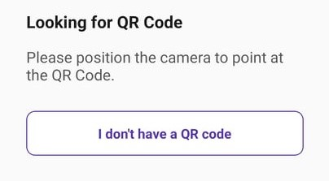
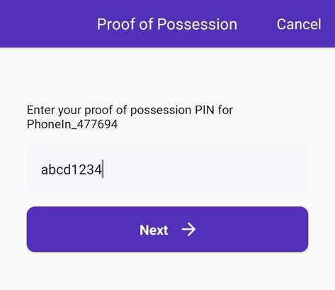
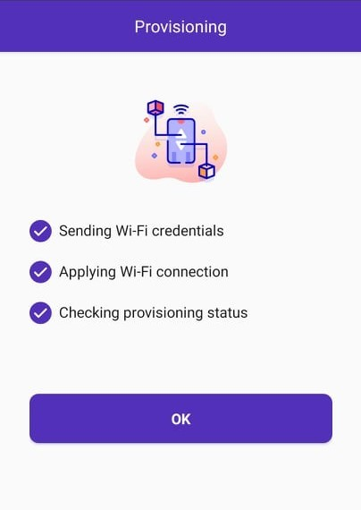

# Wifi hotspot

PhoneIn currently only supports 2.4GHz wifi networks. If you have 5GHz wifi only, please configure a 2.4GHz network too.

You can do it simply in your router settings, for more information please check with your provider.

# Provisioning

For connecting your PhoneIn device to your wifi network, you will only need your PhoneIn, and a smartphone.

There are two ways to provision your PhoneIn. The primary provisioning method uses the built in provisioning tool of the PhoneIn app.

If this method fails for some reason, you can use the secondary provisioning method, but you will need to download a different app for that.

## Primary provisioning method:

For this method, you need to make sure, that your phone is connected to the network, you want to provision to.

If your wifi network is provided by a dual band router, and you have the 2.4GHz and 5GHz network under the same name (SSID), this provisioning method might not work for you.

If you only have a 2.4GHz network, or the 5GHz network has a different SSID, that’s fine!

Please open the PhoneIn app, and choose the “Setup WIFI” option from the menu in the top-right corner.

You’ll find a step by step guide there, for the Wifi provisioning.

## Secondary provisioning method:

If the Primary provisioning method doesn’t work for you for some reason, please follow this guide to provision your PhoneIn device.

1. Download the app called ESP SoftAP Prov!

    
2. Switch provisioning modes on your PhoneIn by holding the wifi button on your PhoneIn device for 10 seconds!
    *   The LED should be off now, with 2 blinks every 10 seconds.
3. Press and hold the wifi button for 5 seconds!
    *   The LED should be on now, with 2 “negative blinks” every 10 seconds. This means that your PhoneIn is ready to be provisioned.
4. Start the ESP SoftAP Prov app.
5. Follow the steps in the app
    *   When it asks for a QR code, press “I don’t have a QR code”
        

    *   When it first asks you to connect to your device, the SSID of your PhoneIn device should look similar to PhoneIn_123456.

        
    *   When it asks for the proof of possession PIN, use the default “abcd1234”!

        
6. When the provisioning succeeds, the LED will turn off.

    

Your device is now ready to be used!
